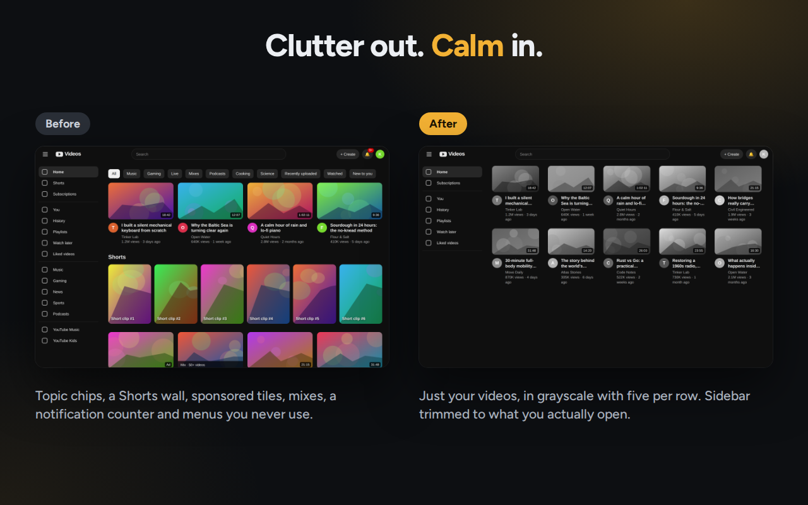
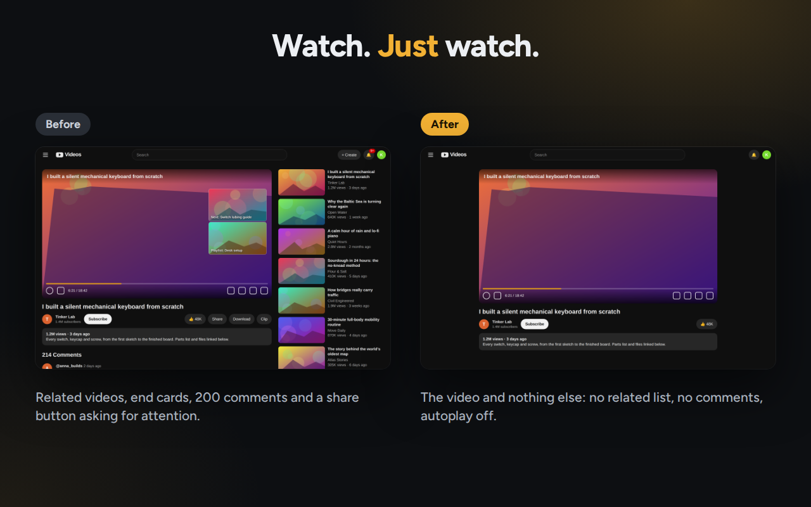
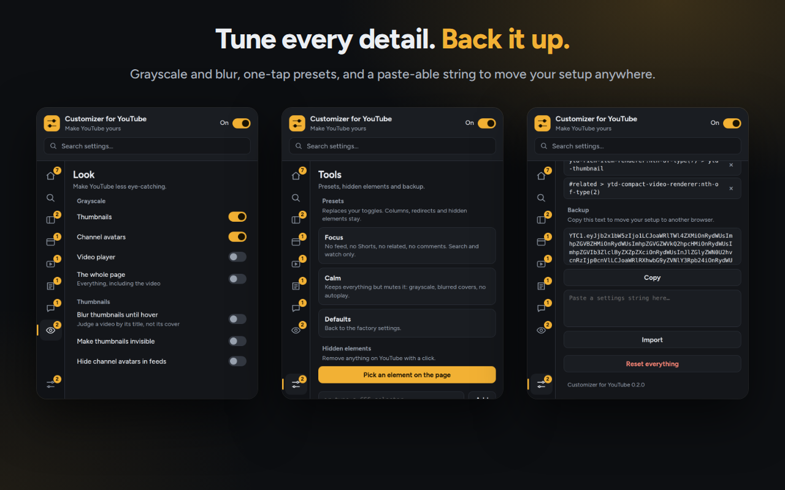

# LessTube

  

  <strong>Less clutter. More control.</strong> 
  Customize YouTube, hide distractions, and make your viewing experience your own.

  <a href="#features">Features</a> ·
  <a href="#installation">Installation</a> ·
  <a href="#privacy">Privacy</a>

---

## See LessTube in action

  

  <em>A cleaner YouTube interface, tailored to your preferences.</em>

<table>
  <tr>
    <td width="50%" align="center">
      
      <strong>Customize your viewing experience</strong>
    </td>
    <td width="50%" align="center">
      
      <strong>All your settings in one place</strong>
    </td>
  </tr>
</table>

## Features

- **Hide distractions** — remove unwanted sections and interface elements.
- **Customize the layout** — adjust the video grid and number of columns.
- **Personalize YouTube** — hide or restyle supported page elements.
- **Element picker** — select elements directly on the page.
- **Import and export settings** — back up or transfer your configuration.
- **English and Polish interface.**

## Installation

### Load unpacked

1. Clone or download this repository.
2. Open `chrome://extensions` in Chrome.
3. Enable **Developer mode**.
4. Click **Load unpacked**.
5. Select the LessTube project directory.

Open YouTube and configure the extension using the LessTube popup.

## Development

LessTube is built with JavaScript, CSS, HTML, and Manifest V3.

| File | Purpose |
|---|---|
| `shared.js` | Settings schema, CSS generation, import/export, and selector utilities |
| `content.js` | YouTube DOM logic, redirects, and element picker |
| `style.css` | Layout and video grid styling |
| `popup.html` | Settings interface |
| `popup.css` | Popup styling |
| `popup.js` | Popup logic |
| `_locales/` | Localized interface strings |
| `fonts/` | Figtree font files |

### Adding a setting

Most settings can be added through a single entry in `shared.js`. The shared schema defines the setting key, English and Polish labels, and associated selectors or CSS. The popup, styling, and import/export functionality use this schema.

## Privacy

LessTube uses Chrome's storage API to save user preferences. It does not make external network requests, use analytics, or load remote code.

## Compatibility

- Google Chrome 105 or newer
- Manifest V3

## License

See the [LICENSE](LICENSE) file for license terms.
