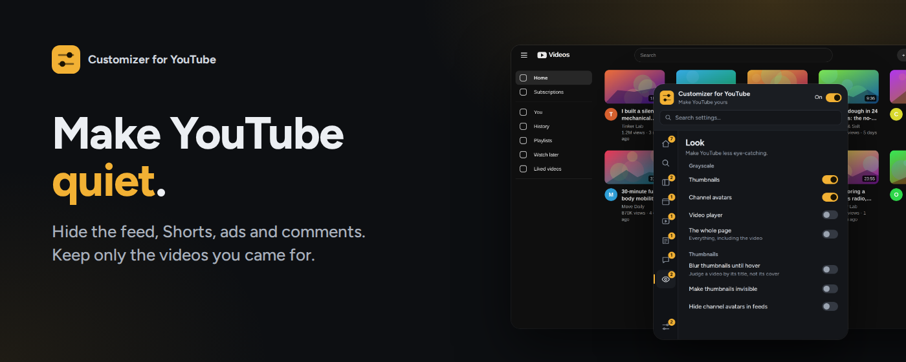

# LessTube

**Less clutter. More control.**

LessTube is a lightweight Chrome extension that lets you customize the YouTube interface, hide unwanted elements, and make your viewing experience your own.

## Screenshots

<!-- Replace these paths with your actual screenshots. -->

  
  
  

## Features

- **Hide unwanted elements** — remove distracting sections and interface components.
- **Customize the layout** — adjust the video grid and number of columns.
- **Personalize the interface** — hide or restyle supported YouTube elements.
- **Element picker** — select elements directly on the page, where supported.
- **Import and export settings** — back up and transfer your configuration.
- **Simple settings popup** — manage your preferences in one place.
- **English and Polish localization.**

## Installation

### Load unpacked

1. Clone or download this repository.
2. Open `chrome://extensions` in Chrome.
3. Enable **Developer mode**.
4. Click **Load unpacked**.
5. Select the project directory.

Open YouTube and configure the extension using the LessTube popup.

## Development

The project uses JavaScript, CSS, HTML, and Manifest V3.

| File | Purpose |
|---|---|
| `shared.js` | Settings schema, CSS generation, import/export, and selector utilities |
| `content.js` | YouTube DOM manipulation, redirects, and element picker |
| `style.css` | Layout and video grid styling |
| `popup.html` | Extension settings interface |
| `popup.css` | Popup styling |
| `popup.js` | Popup logic |
| `_locales/` | Localized interface strings |
| `fonts/` | Figtree font files |

### Adding a setting

Most settings can be added through a single entry in `shared.js`, including the setting key, English and Polish labels, and the associated selectors or CSS. The popup, styling, and import/export functionality use the shared settings schema.

## Privacy

LessTube is designed to customize the YouTube interface.

- Settings are stored using Chrome's storage API.
- The extension does not make external network requests.
- No analytics or remote code are used.
- The extension operates on YouTube pages through its declared content-script match.

## Compatibility

- Google Chrome 105 or newer.
- Manifest V3.

## License

See the repository's license file for the terms governing use and distribution.
